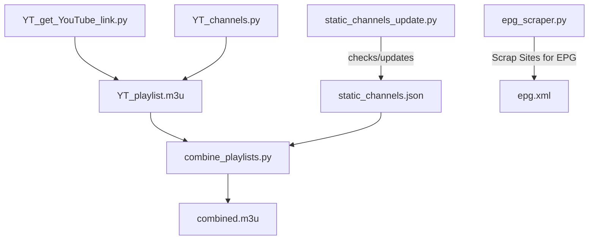

# 📺 IPTV

**Copy this link for IPTV**
```bash
https://raw.githubusercontent.com/BidyutRoy2/IPTV/refs/heads/main/combined.m3u
```

---  

**IPTV Playlist & EPG Manager**

This project is a lightweight yet powerful IPTV playlist and EPG manager, designed as a **personal coding project** to maintain a reliable IPTV setup for **personal use**. All included links are collected from publicly available sources and other GitHub repositories.

I **do not host or distribute any copyrighted content**. This project is purely intended for **educational and personal use**, helping users organize and manage IPTV playlists and EPG data efficiently. All resources provided are sourced from publicly accessible platforms, ensuring compliance with copyright regulations.

**⚡ Key Features**

* 📺 Seamless IPTV playlist management
* 🗓 Integrated EPG for a richer viewing experience
* 🖥 Intuitive interface for personal IPTV setups
* 🌐 Fully sourced from publicly available platforms, ensuring legal compliance

**Note:** This project is intended **strictly for personal and educational use**. All content is collected from public sources.

---

## 🚀 Features

* 📺 **YouTube Playlist Support** – Capture live YouTube channels automatically in `YT_playlist.m3u`.
* 🎛 **Playlist Aggregation** – Merge multiple playlists into one organized list in `combined.m3u`.
* 🔗 **Link Status Checker** – Automatically update link status for `static_channels.json` and `static_movies.json`.
* 🗓 **EPG Scraper** – Generate or refresh `epg.xml` for accurate TV guide support.
* ⚙️ **Fully Automated** – CI/CD workflows regenerate playlists and EPG guides without manual effort.
* 💡 **Easy to Use** – Minimal setup required, designed for personal IPTV setups.

---

## 🗂 Project Structure

```
IPTV/
├── .github/workflows/         # CI/CD pipelines for automation
├── YT_channels.py             # YouTube channels list
├── YT_get_YouTube_link.py     # Get m3u8 links from YouTube
├── combine_playlists.py       # Combines YouTube and static channels playlist into one
├── epg_scraper.py             # Scrapes and generates EPG (XML format)
├── static_channels_update.py  # Updates static channels status automatically
├── static_channels.json       # Predefined static channels (outpot)
├── YT_playlist.m3u            # Playlist generated from Youtube (output)
├── combined.m3u               # Final generated playlist (output)
└── epg.xml                    # Final generated TV guide (output)
```

---

## 📊 Workflow Diagram



---

## ⚙️ Installation & Usage

1. **Clone the repository:**

```bash
git clone https://github.com/BidyutRoy2/IPTV.git
cd IPTV
```

2. **Install Python dependencies:**

```bash
python -m pip install --upgrade pip
pip install requests beautifulsoup4 lxml playwright pytz yt_dlp
playwright install chromium
```

3. **Install FFmpeg** (required for stream processing):

#### Linux / macOS

```bash
# Download and extract FFmpeg
wget -q https://github.com/BtbN/FFmpeg-Builds/releases/download/latest/ffmpeg-master-latest-linux64-gpl.tar.xz -O ffmpeg.tar.xz
tar -xf ffmpeg.tar.xz
FFMPEG_DIR=$(ls -d ffmpeg-master-*)
# Copy binaries to system path (requires sudo)
sudo cp "$FFMPEG_DIR/bin/ffmpeg" /usr/local/bin/
sudo cp "$FFMPEG_DIR/bin/ffprobe" /usr/local/bin/
ffmpeg -version
```

> If you don’t have `sudo` access, extract FFmpeg to a local folder and add it to your PATH:

```bash
export PATH="$PWD/$FFMPEG_DIR/bin:$PATH"
```

#### Windows

1. Download a static build from [FFmpeg Builds](https://www.gyan.dev/ffmpeg/builds/).
2. Extract to a folder (e.g., `C:\ffmpeg`).
3. Add the `bin` folder to your system PATH or PyCharm terminal PATH.
4. Verify installation:

```powershell
ffmpeg -version
```

> FFmpeg will now work in terminals and Python scripts (`subprocess` or `ffmpeg-python`).

4. **Find outputs:**

* `combined.m3u` → your IPTV playlist
* `epg.xml` → your TV guide

---

## 🖼 Example Output

**Sample combined.m3u:**
```m3u
#EXTM3U
#EXTINF:-1 tvg-id="BBCWORLD" group-title="News",BBC World News
http://example.com/stream/bbcworld
```

---

## 🛠 For Developers

- Add new channels by editing `static_channels.json`.
- Add new movies by editing `static_movies.json`.
- Add new YouTube channels by editing `YT_channels.py`.
- Modify YouTube extraction rules in `YT_get_YouTube_link.py`.
- Modify playlist combination rules in `combine_playlists.py`.
- Modify movies onnline/offline status logic in `static_movies_update.py`.
- Modify channels onnline/offline status logic in `static_channels_update.py`.
- Extend EPG scraping logic in `epg_scraper.py` for custom sources.

---

## 🤝 Contributing

Contributions are welcome! Fork the repo, make your changes, and submit a PR.

---

## 📜 License

MIT License – free to use, modify, and share.

---

## ❤️ Maintainer Notes

This project is maintained as a **hobby** and for family use. It's a fun way to keep learning Python while keeping IPTV streams organized for daily use.
